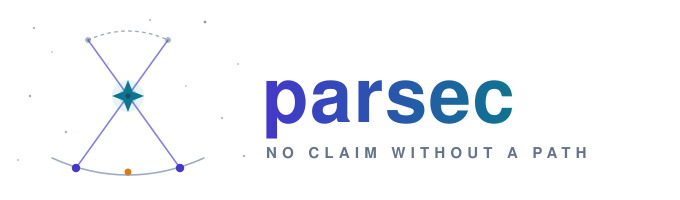
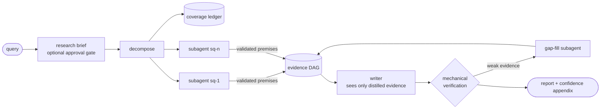

<p align="center">
  <picture>
    <source media="(prefers-color-scheme: dark)" srcset="assets/logo-dark.svg">
    
  </picture>
</p>

<p align="center"><strong>The research agent harness that shows its work.</strong><br>
Claims triangulated across independent sources · confidence computed, never asserted · every run replayable byte-for-byte</p>

<p align="center">
  
  
  
  
  
</p>

---

## Why parsec

Parallax is how astronomers find true distance: observe a star from two ends of Earth's orbit and measure the shift against the background. A **parsec** is the distance at which that shift is one arcsecond — truth derived from independent vantage points, geometrically, not by trusting any single observation.

Parsec applies the same principle to LLM research agents. Most agents produce fluent reports you have to take on faith. Parsec produces reports you can **audit mechanically**:

- **No claim without a path.** Every sentence in the final report traces through a typed evidence graph — claim → finding → premise → verbatim source span — or it is rejected before you ever see it.
- **No confidence without computation.** Sources carry priors, independent corroboration raises credence via noisy-OR, shaky chains visibly decay, and the report's hedging ("X is true" vs. "one source suggests") is a function of the computed number — never vibes.
- **No run that can't be replayed.** Every fetch is content-addressed, every model call and state transition is event-logged. Any session re-executes byte-identically against its frozen corpus, which makes every harness change measurable.

The model never executes anything: it emits structured intents; the harness validates, executes, and records (see the design tenets below).

## How it works



1. **Scope, then decompose.** The orchestrator produces a persisted *research brief* — scope, an effort estimate the harness enforces as dispatch caps (quick / standard / deep), and the subquestions — each tracked in a coverage ledger (`open / answered / partial / blocked / dropped` — blocked requires an explicit reason, and the writer refuses to run while anything is still open). With `--brief-gate`, the brief waits for your approval or edits, recorded as steering events so the gated session still replays.
2. **Research in isolation.** Each subquestion gets a subagent with retrieval tools only — subagents are the *only* consumers of raw documents, and they cannot spawn subagents (the recursion ban is structural, not a prompt). Facts enter the system through one door: a `record_premises` tool that rejects any premise whose numbers or quotes don't match the cited span exactly.
3. **Write behind a firewall.** The writer sees the query, the recorded premises/findings with computed confidence tiers, and the coverage gaps — never a raw document, never the research transcript. Every factual sentence must cite premise/finding IDs.
4. **Verify mechanically.** Structural checks (every claim reaches an intact span), exact number/quote containment, temporal-ordering checks against evidence dates, grounded-NLI support advisories (does the span actually *say* that?), credence propagation, and bottom-up omission detection — what did the report *fail* to say? — all run without a remote model. A claim below the stakes threshold becomes a search gradient: the harness localizes the weakest premise and dispatches one targeted gap-fill subagent. Coverage gets the same treatment: a subquestion still *partial* while budget headroom remains is retried with its shortfall named (`--max-coverage-gap-rounds`), and a primary-tier source that yielded no readable text (an unminable PDF, a blocked fetch) demotes its subquestion to partial — the loss is named in the ledger and the report, never silently papered over with secondary sources.
5. **Report honestly.** The answer ships with a harness-built appendix: per-claim confidence tiers, sources consulted but unused, premises recorded but uncited.

## Design tenets

The load-bearing decisions; when an implementation choice conflicts with a tenet, the tenet wins. Code comments cite these by number (T1–T12).

- **T1 — The harness owns all side effects.** The model never executes anything: it emits structured tool-call intents; the harness validates, executes, truncates, and injects results. The model is a stateless planner/synthesizer.
- **T2 — Research has no oracle, so verification must be structural.** There is no "tests pass" for a report; the machine-checkable substitute is the evidence DAG — every claim traces through typed derivation edges to source spans. Verification is graph traversal first, LLM judgment last.
- **T3 — Premises carry credence, never presumption.** No source is assumed true: every root node gets a computed prior (source tier × independent corroboration × recency-vs-volatility), and confidence propagates rather than being asserted.
- **T4 — Everything is replayable.** Content-addressed fetches, event-logged model/tool calls and state transitions; any run re-executes byte-identically against its frozen corpus. Without this, no change to the system is measurable.
- **T5 — Context is a budgeted resource with an explicit ledger.** Per-turn token accounting, cache-aware prompt assembly (stable prefix, append-only suffix), and a compaction ladder that degrades gracefully.
- **T6 — Subagents are context firewalls.** The orchestrator never sees a raw document; subagents burn their windows on sources and return typed findings. Recursion is banned structurally, not by prompt.
- **T7 — Rippable over clever.** Model capabilities improve fast; prefer thin, deletable mechanisms. The durable assets are the data model, the corpus, and the eval suite — not the loop logic.
- **T8 — Concurrency is recorded, not forbidden.** Parallel subagents are fine because every nondeterministic boundary — and its arrival order — is journaled; replay feeds recorded results through a deterministic scheduler.
- **T9 — Verification is tiered by trust, and the mechanical tier is never enough.** Structure < grounded-NLI support < advisory judge; every new verifier is benchmarked before it gates anything, and NLI never sole-gates — exact-match stays the floor.
- **T10 — Credence must survive correlated, conflicting, and stale evidence.** Corroboration counts independent content clusters (not domains); conflict lowers confidence rather than averaging away; facts carry mutability classes and can be superseded; the numbers get recalibrated or stay internal.
- **T11 — The archive is ours; provider responses are borrowed.** The content-addressed archive of self-fetched documents is permanent (the replay substrate); provider API responses are TTL-bounded per provider policy. Fetching is identity-honest: descriptive UA, robots respected, 402/RSL surfaced as typed outcomes, never circumvented.
- **T12 — Every improvement lands with its measurement.** No workstream merges without the eval that detects its regression; paired-difference stats with confidence intervals replace raw threshold gates.

> Historical note: code comments also cite section and workstream labels (`§n`, `WS-x`) from the original architecture brief and v2 plan, which have been retired from the tree — both are preserved in git history (`git log --all --oneline -- RESEARCH_HARNESS_ARCHITECTURE.md RESEARCH_HARNESS_V2_PLAN.md`).

## Install

Requires Python 3.12+ and [uv](https://docs.astral.sh/uv/).

```sh
git clone https://github.com/finianoneill/parsec.git
cd parsec
uv sync
uv run pytest        # full suite — no network, no API keys needed
```

To get a `parsec` command on your PATH (so it runs from any directory, not just via `uv run` inside the repo):

```sh
uv tool install --editable .   # installs ~/.local/bin/parsec; --editable tracks your checkout
```

Live runs need `ANTHROPIC_API_KEY`. The optional synthesis judge needs `OPENAI_API_KEY` (a *different model family* grades the prose — parsec never lets a model grade its own homework).

## Quick start

No API keys? Start with the interactive shell and the built-in demo:

```sh
# Launch the interactive shell (welcome screen + REPL). With no
# ANTHROPIC_API_KEY it points you at the offline tour:
parsec

# Or run the demo directly: a complete recorded run — scripted model,
# bundled fixture corpus, no keys, no network. The recording is a real
# session you can replay, verify, and inspect afterwards:
parsec demo
```

(Prefix commands with `uv run` instead if you skipped the global tool install.)

### The interactive shell

Running `parsec` with no subcommand prints the welcome banner — the parallax mark, the gradient wordmark, and a status line showing your data directory and whether an API key was found — then drops into a REPL:

```
parsec ❯ /demo               # offline tour: full recorded run, no keys, no network
parsec ❯ /sessions           # list recorded sessions
parsec ❯ /show <id>          # one session's spend and coverage
parsec ❯ /replay <id>        # re-run against the frozen corpus, verify byte-identical
parsec ❯ /verify <id>        # mechanical verification + credence report
parsec ❯ /notebook <id>      # the session's append-only notebook
parsec ❯ how tall is Olympus Mons        # bare text runs a live query (needs a key)
parsec ❯ /edit               # compose a long/multi-line query in $EDITOR
parsec ❯ /exit               # leave (ctrl-d works too)
```

The shell keeps arrow-key history across sessions (`~/.parsec_history`), and `/edit` opens `$EDITOR` to compose long or multi-line queries.

Sessions record into `./data` relative to where you launch; pass `--data-dir` (or set `data_dir` in a config file, below) to keep one home for all recordings.

### Configuration files

Every flag you'd otherwise repeat can live in JSON config, layered as `~/.parsec.json` (user) < `./.parsec.json` (project) < explicit flags. Keys mirror the CLI option names; string values expand `${ENV_VARS}`:

```json
{
  "data_dir": "~/.parsec/data",
  "search_provider": "searxng",
  "searxng_url": "http://localhost:8080",
  "contact": "you@example.com",
  "max_usd": 2.0
}
```

Unknown keys are rejected loudly (typo protection). The interactive banner shows which config files were loaded.

### Claude via Amazon Bedrock

If your org reaches Claude through Bedrock instead of an Anthropic API key, install the signing dependencies and point the adapter at your AWS profile:

```sh
uv sync --extra bedrock              # or: uv tool install --editable ".[bedrock]"
okta-awscli --profile okta           # or aws sso login, etc. — anything that writes
                                     # credentials into the standard AWS chain
```

Then set it once in config (or pass `--adapter bedrock --aws-region … --aws-profile …` per run):

```json
{
  "adapter": "bedrock",
  "aws_region": "us-east-1",
  "aws_profile": "okta"
}
```

Auth is the standard AWS credential chain — env vars, then `~/.aws/credentials` — which is exactly where okta-awscli drops its temporary STS credentials, so re-running `okta-awscli` when they expire is the whole refresh story. Model IDs are prefixed automatically (`claude-opus-5` → `anthropic.claude-opus-5`); no `ANTHROPIC_API_KEY` is needed. Recording, replay, and budgets behave identically to the first-party adapter.

### Editing the research brief in $EDITOR

With `ask --brief-gate`, the run pauses at the proposed research brief. Besides typing `approve` or feedback on stdin, type `edit` to open the proposed brief (scope, effort, subquestions) in `$EDITOR` — the text you save is submitted as the brief-edit steering message, so the gated session still replays byte-identically.

With a key, live runs work from the shell or the CLI:

```sh
export ANTHROPIC_API_KEY=...

# Ask a question with a live search provider (SearXNG shown; brave/serper
# need BRAVE_API_KEY / SERPER_API_KEY). fetch is robots-respecting and
# write-through cached; provider responses are cached TTL-bounded:
parsec ask "your question" --search-provider searxng --searxng-url http://localhost:8080 --live

# Or run fully offline with a fixture provider:
parsec ask "your question" --search-fixtures fixtures/queries.json

# Re-run it against the frozen corpus and verify byte-identical replay:
parsec replay <session-id>

# Re-verify the evidence graph later (catches corpus tampering after the fact):
parsec verify <session-id>
```

A search fixture file maps queries to result URLs:

```json
{
  "your question keywords": [
    {"title": "Page title", "url": "https://example.com/page", "snippet": "..."}
  ]
}
```

While a run is live, type on stdin to **steer** it — your message is injected into the next model call without tearing down the turn, and steered sessions still replay byte-identically.

## Commands

| Command | What it does |
|---|---|
| `parsec` | Interactive shell: welcome screen + REPL over the commands below (bare text runs `ask`) |
| `parsec demo` | Built-in offline demo — a full recorded run with no API keys and no network |
| `parsec ask "…"` | Run a research query. In a terminal, a live activity view narrates the run — thinking, searches, fetches with typed outcomes, subagent dispatch/joins, phase changes, spend — straight from the event stream (`--live` forces it, `--json` disables). (`--parallel N` for concurrent subagents (≤5), `--brief-gate` to approve/edit the research brief before dispatch, `--max-usd`/`--max-tokens`/`--max-turns`/`--max-gap-rounds`/`--max-coverage-gap-rounds` for budgets, `--cache-mode record\|replay\|live-prefer-cache`) |
| `parsec replay <session>` | Re-execute against the frozen corpus; verifies projections and answer bytes are identical |
| `parsec verify <session>` | Mechanical verification (structural, temporal ordering, grounded-NLI advisories) + credence + omission report over the stored evidence graph |
| `parsec fork <session> --at-call N` | Rewind to model-call N and branch live (`--steer "…"` to redirect the branch) |
| `parsec judge <session>` | Advisory judge pass (different model family) over `deduces`/`induces` derivations |
| `parsec eval make-case <session>` | Snapshot a recorded session into a frozen eval case |
| `parsec eval run <cases> --out r.json` | Score cases on 3 axes: citation faithfulness, coverage vs. gold, judged synthesis |
| `parsec eval compare a.json b.json` | Diff two results files; exits nonzero on regression beyond epsilon |
| `parsec calibrate labels.json` | Fit Platt scaling over labeled credences (eval results files work directly); reports Brier, smooth ECE, risk-coverage, and the tier ranges `ask --calibration` renders |
| `parsec sessions list` / `show <session>` | Sessions, spend, and the coverage ledger |
| `parsec notebook <session>` | The session's append-only notebook (plan, statuses, evidence IDs, dead ends) |
| `parsec spans show <span-id>` | Spot-check any citation against the verbatim stored span |

## The evidence graph

Five node tiers, six typed edges — the edge type selects the verification strategy:

| Tier | Node | Produced by |
|---|---|---|
| 0 | `SourceSpan` | fetch: verbatim text at `doc:<hash>#<start>-<end>` |
| 1 | `Premise` | `record_premises`, after mechanical number/quote containment checks |
| 2 | `Finding` | subagent reports: derived via `deduces` / `induces` / `temporal` edges |
| 3 | `Synthesis` | cross-subagent merges (reserved) |
| 4 | `ReportClaim` | one per factual sentence in the final answer |

Conflicting evidence gets `contradicts` edges — and they participate in propagation: opposing support becomes disbelief, so two strong disagreeing sources land near "genuinely uncertain" instead of both reading as near-certain (on a mutable claim, newer evidence *supersedes* older instead). Credence propagates as `min(parents) × edge_penalty` along a chain and noisy-OR across independent paths, with corroboration counted per independent *content* cluster — twelve syndicated copies of one wire story count once, whatever domains they sit on. Users see tiers plus uncertainty provenance — high / moderate / low, single source, conflicting sources, possibly stale, superseded — never raw numbers pretending to be calibrated probabilities. Once `parsec calibrate` has fitted your measured outcomes, tiers render with quantified ranges ("high (72–96%)").

## Determinism & budgets

**Byte-identical replay** means: the canonical projection of the event stream (timestamps stripped; token and dollar debits kept) and the final answer blob are byte-equal between a run and its replay. Everything that could break this is engineered around it: content-derived IDs, canonical JSON everywhere, deterministic compaction, steering re-injection, clock-free credence. Concurrency doesn't break it either (`ask --parallel N`, N≤5): each subagent is its own event stream, the observed completion order is journaled as join events, and replay folds results in the *recorded* order through a deterministic scheduler — the Temporal pattern, so the projection compares per-stream plus join order.

Budget caps default deliberately low and are debited in real time to a per-actor ledger: `$0.50` / `200k tokens` / `300s` / `12 turns`. Raise them explicitly. Fan-out research is a token-spend strategy — parsec makes the spend visible per node of the graph it bought.

## Evals

Every eval case is a frozen world: corpus, fixtures, query, gold `must_find` list. Runs fork the corpus by file copy and execute in replay cache mode, so two git revisions score against literally identical inputs:

```sh
uv run parsec eval run evals/cases --out results-main.json --label main
git checkout my-change && uv run parsec eval run evals/cases --out results-change.json
uv run parsec eval compare results-main.json results-change.json   # exit 3 on regression
```

## Project layout

```
src/parsec/
├── cli.py, interactive.py,      # entry points: subcommands, REPL shell,
│   banner.py, demo.py           #   welcome banner, keyless offline demo
├── db/, store/      # the durable core: schema, event log, blobs, spans, DAG,
│                    #   coverage ledger, notebook, budget ledger
├── gateway/         # the single door to any model: Anthropic generator,
│                    #   OpenAI judge, fake/replay/fork adapters, cost capture
├── retrieval/       # search-provider seam, cache-routed fetcher, span indexer
├── tools/           # registry + validation: search_broad, fetch, record_premises
├── verify/          # mechanical verification: structure, containment,
│                    #   credence, omission, judge pass
├── evals/           # frozen cases, 3-axis scoring, regression compare
└── loop/            # the deliberately thin, rippable part: state machine,
                     #   prompts, citations, compaction, orchestrator
```

The loop is replaceable by design; the durable assets are the data model, the corpus, and the eval suite.

## Milestones

All seven milestones of the original architecture brief are complete — **M0–M5 was the v1 definition of done; M6 is polish.**

<details>
<summary>Full milestone log (M0–M6)</summary>

- [x] **M0 — Skeleton**: SQLite schema (sessions, event log, documents/cache, spans, DAG, ledger), content-addressed blob store, Pydantic models (§4 schema rules enforced at construction), model gateway with cost capture, event-log replay test.
- [x] **M1 — Single-agent loop**: explicit state machine with budget/turn/wall-clock gates, tool layer (`search_broad` stub + live cached `fetch`), span-addressed ingestion, fetch cache record/replay modes, citation checking with one repair round-trip, CLI. *Exit test: one query → cited answer, every claim resolving to a cached span, replayed byte-identically with zero HTTP calls.*
- [x] **M2 — Evidence DAG + structural verification**: facts enter the DAG only via the harness-validated `record_premises` tool (numbers/quotes must match spans exactly or carry a transform note); the writer phase is a context firewall citing `[premise:<id>]` per sentence; stage-1 structural verification runs at the end of every session and on demand via `parsec verify`. *Exit test: corrupt a cached span after the run → `parsec verify` mechanically flags both the corruption and the dependent claim, by ID, no model involved.*
- [x] **M3 — Fan-out**: schema-validated decomposition with deterministic fallback, coverage ledger with the writer precondition, per-subquestion subagents as the only consumers of raw documents (structural recursion ban), `submit_report` contract producing tier-2 Findings, append-only notebook. Subagents run sequentially in v1 so event order — and byte-identical replay — stays deterministic. *Exit test: multi-part question → ledger fully resolved or explicitly blocked; orchestrator calls provably contain no raw document content.*
- [x] **M4 — Credence + omission**: source-tier priors (per-run overridable), corroboration via independent URL-domain clusters with noisy-OR, flat volatile penalty (clock-free by design), min-path × edge-penalty propagation persisted onto nodes; the writer applies a computed hedging register; bottom-up omission detection surfaces consulted-but-unused sources in a harness-built appendix. *Exit tests: a planted blog-tier source → downstream claim flagged and hedged; a planted ignored source → listed in the appendix.*
- [x] **M5 — Eval harness**: frozen self-contained cases, replay-mode execution, 3-axis scoring (mechanical citation faithfulness, mechanical coverage vs. gold, advisory judged synthesis via a different model family), and the regression runner that makes any harness change measurable. **v1 definition of done reached.**
- [x] **M6 — Polish**: deterministic compaction ladder (evict → reset, evidence carried forward), mid-run steering with replay re-injection, `parsec fork --at-call N` (head provably rejoins history, then diverges live), advisory judge pass over derivation edges, bounded gap-fill loop (`sq-gap-N` targets the weakest premise verbatim), live progress view.

</details>

## Development

```sh
uv run pytest                                        # 354 tests, no network/keys
uv run pytest -m live tests/integration/test_live_smoke.py   # one real query + replay (needs ANTHROPIC_API_KEY)
```

Changes should keep the whole suite green and — for anything touching the loop, tools, or stores — preserve byte-identical replay; the integration tests will catch you if they don't.

## Roadmap (v2)

**All six v2 milestones are complete** — M7–M10 was the v2 definition of done; M11–M12 were the high-value stretch (the research-backed v2 plan behind them is preserved in git history):

- [x] **M7 — Live retrieval**: SearXNG/Brave/Serper adapters behind the extended provider protocol with TTL-bounded provider caches (T11: provider responses are borrowed data, the self-fetch archive is permanent); trafilatura main-content extraction with markdown output and stdlib fallback; `search_within` hybrid search over the fetched corpus (SQLite FTS5 BM25 + cached deterministic embeddings + reciprocal-rank fusion); politeness 2.0 — robots.txt respected per agent group, HTTP 402 and RSL `License:` terms surfaced as typed cached fetch outcomes (never circumvented), identity-honest UA with contact info. *Exit test green: a live-provider query end-to-end, replayed byte-identically with zero live calls; blocked and licensed URLs surface as typed outcomes that also replay.*
- [x] **M8 — Evals 2.0**: gold is now weighted binary nugget rubrics (vital/okay) with **contradiction patterns** — a report asserting the opposite of the gold scores worse than silence; cases carry verified `gold_docs` and planted `distractor_docs` (hard negatives); a new **claim-support axis** grades every claim against the verbatim spans behind it from the frozen cache (deterministic mechanical checker behind a `SupportChecker` seam — the grounded-NLI implementation slots in at M9); **trajectory metrics** (gold-fetch fraction, distractor fraction, redundant searches, repeated calls, tokens/$) ride along in results; and the regression runner does **paired-difference statistics** — per-axis three-state verdicts (improved/regressed/inconclusive) from mean paired deltas with 95% CIs, epsilon fallback for single cases, `--runs N` per-case means. *Exit test green: a lucky retriever that fetched only the planted distractor keeps perfect claim support (its bad source does say 90°) but is caught by the nugget contradiction check and zero gold-fetch fraction; compare flags exactly `nugget_recall` as regressed with n=2 and a correct CI; comparing a run against itself reads all-inconclusive.*
- [x] **M9 — Verification depth**: **grounded-NLI premise support** behind a two-tier local seam — a deterministic lexical checker always on (advisory NOTE back to the subagent at `record_premises` time, recorded stage-2 advisories in `parsec verify`) with span-level unsupported-term flags, plus HHEM-2.1-Open as opt-in escalation (`parsec[nli]` extra, `--nli-checker hhem`); per T9 the NLI tier is advisory and never sole-gates — exact-match containment stays the floor. **Claimify-style ambiguity-refusal lints**: a premise with a bare pronoun subject, an unnamed "the study"-class referent, vague degree words with no quantity or quote, or multiple sentences is *rejected at record time with the reason*, not recorded vaguely. **Mechanical temporal validator**: time expressions on premises (or their spans) become date intervals, and ordering findings on `temporal` edges are checked by conservative interval constraints — a definite contradiction is a real violation that condemns dependent claims, an undecidable finding is surfaced as an advisory, never guessed. **Dual-perspective gap-fill**: the targeted subagent now hunts the weak claim AND its negation, so conflicts feed `contradicts` edges instead of surfacing by accident. The eval claim-support axis can grade with the grounded tier (`eval run --support-checker grounded`) over the unchanged exact-match floor. *Exit test green: a paraphrased-but-unsupported premise that passes exact-match containment is caught by the NLI tier at record time and in verification; an ordering claim contradicted by evidence timestamps is mechanically flagged along with the claim resting on it; "The study showed benefits." is refused at record time with the reason.*
- [x] **M10 — Credence 2.0 + calibration**: **syndication-aware corroboration** — independence is judged by *content*, not URL domain: spans cluster by deterministic embedding similarity (union-find over the same hashed-n-gram embedder `search_within` uses), so a wire story republished across outlets corroborates once; **conflict-aware aggregation** — `contradicts` edges finally participate in propagation: opposing support becomes disbelief and credence renormalizes as `b(1−d)/(1−b·d)`, degrading to plain noisy-OR when unopposed and landing two strong disagreeing sources near "genuinely uncertain" (strictly lower than either alone — v1 could not express this); **mutability classes + supersession** — premises carry FreshQA-style `stable`/`slow`/`volatile` classes with clock-free age decay (evidence age is measured against the newest recorded evidence timestamp, so replay stays byte-identical), and on a mutable claim newer contradicting evidence *supersedes* the older fact — marked and discounted, never averaged into the newer one; **learned source reliability** — opt-in truth-discovery iteration (`--learned-reliability`) adjusts tier priors from agreement patterns in the session's own graph, leave-one-out so a domain never vouches for itself, hard-capped at ±0.1 around the prior and provenance-stamped; **`parsec calibrate`** — evals now harvest mechanically-labeled (credence, outcome) pairs per claim, the CLI fits Platt scaling (fixed-iteration Newton, no dependencies; Platt over isotonic per sample-efficiency evidence) and reports Brier, kernel-smoothed ECE, and a risk-coverage curve; the fitted ranges freeze into `RunConfig` so tiers render with quantified ranges ("high (72–96%)") and per-claim uncertainty provenance ("conflicting sources" / "possibly stale" / "superseded") — replay-identically. *Exit test green: two syndicated copies of one wire story corroborate no more than one does; two strong disagreeing sources yield lower credence than either alone; calibration on ≥200 labeled claims measurably improves Brier vs. the uncalibrated heuristic; superseded stale facts render as superseded, not averaged.*
- [x] **M11 — Deterministic parallelism**: the Temporal pattern lands — parallel subagents are allowed because concurrency is *recorded*, not forbidden (T8). **Per-subagent event streams**: every event carries a `(stream_id, stream_idx)` coordinate assigned from a contextvar that asyncio tasks inherit, so a concurrent subagent's model calls, tool events, DAG writes, and debits land in its own internally-sequential stream without touching a single call site; the replay adapter keys model calls by (stream, per-stream call index) instead of global arrival order. **Recorded join order**: subagents run in waves of ≤5 (`ask --parallel N`); the one genuinely nondeterministic cross-stream fact — completion order — is journaled as `SUBAGENT_JOINED` events, and results are folded into shared state (findings, coverage, notebook, the writer's input order) only at join time; on replay a deterministic scheduler applies the *recorded* order, so a replay whose tasks finish in a different order still reproduces the projection byte-for-byte, which now compares per-stream plus join order. **Per-stream budget attribution**: in-flight gates read only their own stream's spend against a wave allowance snapshotted at the (deterministic) dispatch boundary — never live global totals that vary with sibling interleaving. **Failure semantics**: adapter failures are journaled (`LLM_FAILED`) and raised as a typed `ModelCallFailed`, so a subagent dying mid-wave resolves its coverage row as blocked-with-reason, the wave survives, and the failure itself replays identically. Parallelism is research-only (the writer stays single, gap-fill stays one targeted subagent); sequential mode remains the default and permanent fallback, and is what `fork --at-call` requires. *Exit test green: a 3-subagent concurrent run — with a deliberately slowed subagent so join order ≠ dispatch order — replays byte-identically per-stream and in the recorded join order with zero live calls; a subagent killed mid-wave leaves a blocked-with-reason coverage row and a byte-identically replayable session; a starved wave stops every subagent on its own stream-local allowance, deterministically.*
- [x] **M12 — Orchestration polish**: **research-brief scoping phase** (WS-F.1) — the decomposer now produces a persisted brief (scope, effort estimate, subquestions) journaled as a `RESEARCH_BRIEF` event and rendered into the notebook; with `--brief-gate` the brief becomes an approvable gate: the loop blocks for a steering message, "approve" dispatches, anything else is an edit fed back to the decomposer as an append-only transcript extension — and because approvals and edits are recorded steering events (gate-tagged, turn-indexed), a gated session replays byte-identically, which products treating steering as untracked UI state cannot do. **DAG-slice context reconstruction** (WS-F.2) — compaction rung 2 lands: instead of the once-planned model-written squeeze, an overflowing subagent context is rebuilt as a fresh workspace re-rendered from the evidence DAG (its premises with span refs and source URLs, by ID) plus the session notebook — a deterministic function of the log, better and cheaper; bare reset remains rung 3 for when even the workspace exceeds the budget. **Effort-scaled dispatch** (WS-F.4) — the brief's effort estimate becomes harness-enforced caps: quick = one subagent, ≤3 calls, no gap-fill; standard = small fan-out; deep = the full configured budgets; effort can only clamp below the user's caps, never raise them, and an absent estimate never clamps. **KV-cache prefix audit** (WS-F.3) — shipped as a regression test: per stream and per phase, system+tools must be byte-stable and message lists append-only, with recorded compaction points the only sanctioned prefix break; the brief's scope rides in each subagent's *first* user message so prefixes stay cache-stable. *Exit test green: a long subagent run under a tight context budget reconstructs its workspace from the DAG (rung 2, not bare reset) and completes with identical evidence and an identical answer to the unreconstructed control, then replays byte-identically; brief-gate edit + approval are recorded steering events that replay; effort "quick" provably clamps a 2-subquestion brief to one dispatched subagent.*

## License

[Apache-2.0](LICENSE).
