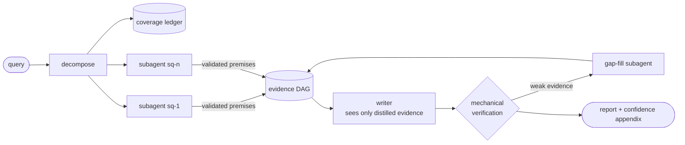

<p align="center">
  <picture>
    <source media="(prefers-color-scheme: dark)" srcset="assets/logo-dark.svg">
    
  </picture>
</p>

<p align="center"><strong>The research agent harness that shows its work.</strong><br>
Claims triangulated across independent sources · confidence computed, never asserted · every run replayable byte-for-byte</p>

<p align="center">
  
  
  
  
  
</p>

---

## Why parsec

Parallax is how astronomers find true distance: observe a star from two ends of Earth's orbit and measure the shift against the background. A **parsec** is the distance at which that shift is one arcsecond — truth derived from independent vantage points, geometrically, not by trusting any single observation.

Parsec applies the same principle to LLM research agents. Most agents produce fluent reports you have to take on faith. Parsec produces reports you can **audit mechanically**:

- **No claim without a path.** Every sentence in the final report traces through a typed evidence graph — claim → finding → premise → verbatim source span — or it is rejected before you ever see it.
- **No confidence without computation.** Sources carry priors, independent corroboration raises credence via noisy-OR, shaky chains visibly decay, and the report's hedging ("X is true" vs. "one source suggests") is a function of the computed number — never vibes.
- **No run that can't be replayed.** Every fetch is content-addressed, every model call and state transition is event-logged. Any session re-executes byte-identically against its frozen corpus, which makes every harness change measurable.

The model never executes anything: it emits structured intents; the harness validates, executes, and records (the design's full rationale lives in [RESEARCH_HARNESS_ARCHITECTURE.md](RESEARCH_HARNESS_ARCHITECTURE.md)).

## How it works



1. **Decompose.** The orchestrator splits the query into subquestions, each tracked in a coverage ledger (`open / answered / partial / blocked / dropped` — blocked requires an explicit reason, and the writer refuses to run while anything is still open).
2. **Research in isolation.** Each subquestion gets a subagent with retrieval tools only — subagents are the *only* consumers of raw documents, and they cannot spawn subagents (the recursion ban is structural, not a prompt). Facts enter the system through one door: a `record_premises` tool that rejects any premise whose numbers or quotes don't match the cited span exactly.
3. **Write behind a firewall.** The writer sees the query, the recorded premises/findings with computed confidence tiers, and the coverage gaps — never a raw document, never the research transcript. Every factual sentence must cite premise/finding IDs.
4. **Verify mechanically.** Structural checks (every claim reaches an intact span), exact number/quote containment, credence propagation, and bottom-up omission detection — what did the report *fail* to say? — all run without a model. A claim below the stakes threshold becomes a search gradient: the harness localizes the weakest premise and dispatches one targeted gap-fill subagent.
5. **Report honestly.** The answer ships with a harness-built appendix: per-claim confidence tiers, sources consulted but unused, premises recorded but uncited.

## Install

Requires Python 3.12+ and [uv](https://docs.astral.sh/uv/).

```sh
git clone https://github.com/finianoneill/parsec.git
cd parsec
uv sync
uv run pytest        # full suite — no network, no API keys needed
```

Live runs need `ANTHROPIC_API_KEY`. The optional synthesis judge needs `OPENAI_API_KEY` (a *different model family* grades the prose — parsec never lets a model grade its own homework).

## Quick start

```sh
export ANTHROPIC_API_KEY=...

# Ask a question with a live search provider (SearXNG shown; brave/serper
# need BRAVE_API_KEY / SERPER_API_KEY). fetch is robots-respecting and
# write-through cached; provider responses are cached TTL-bounded:
uv run parsec ask "your question" --search-provider searxng --searxng-url http://localhost:8080 --live

# Or run fully offline with a fixture provider:
uv run parsec ask "your question" --search-fixtures fixtures/queries.json

# Re-run it against the frozen corpus and verify byte-identical replay:
uv run parsec replay <session-id>

# Re-verify the evidence graph later (catches corpus tampering after the fact):
uv run parsec verify <session-id>
```

A search fixture file maps queries to result URLs:

```json
{
  "your question keywords": [
    {"title": "Page title", "url": "https://example.com/page", "snippet": "..."}
  ]
}
```

While a run is live, type on stdin to **steer** it — your message is injected into the next model call without tearing down the turn, and steered sessions still replay byte-identically.

## Commands

| Command | What it does |
|---|---|
| `parsec ask "…"` | Run a research query (`--live` for the progress view, `--max-usd`/`--max-tokens`/`--max-turns`/`--max-gap-rounds` for budgets, `--cache-mode record\|replay\|live-prefer-cache`) |
| `parsec replay <session>` | Re-execute against the frozen corpus; verifies projections and answer bytes are identical |
| `parsec verify <session>` | Stage-1 structural verification + credence + omission report over the stored evidence graph |
| `parsec fork <session> --at-call N` | Rewind to model-call N and branch live (`--steer "…"` to redirect the branch) |
| `parsec judge <session>` | Advisory judge pass (different model family) over `deduces`/`induces` derivations |
| `parsec eval make-case <session>` | Snapshot a recorded session into a frozen eval case |
| `parsec eval run <cases> --out r.json` | Score cases on 3 axes: citation faithfulness, coverage vs. gold, judged synthesis |
| `parsec eval compare a.json b.json` | Diff two results files; exits nonzero on regression beyond epsilon |
| `parsec sessions list` / `show <session>` | Sessions, spend, and the coverage ledger |
| `parsec notebook <session>` | The session's append-only notebook (plan, statuses, evidence IDs, dead ends) |
| `parsec spans show <span-id>` | Spot-check any citation against the verbatim stored span |

## The evidence graph

Five node tiers, six typed edges — the edge type selects the verification strategy:

| Tier | Node | Produced by |
|---|---|---|
| 0 | `SourceSpan` | fetch: verbatim text at `doc:<hash>#<start>-<end>` |
| 1 | `Premise` | `record_premises`, after mechanical number/quote containment checks |
| 2 | `Finding` | subagent reports: derived via `deduces` / `induces` / `temporal` edges |
| 3 | `Synthesis` | cross-subagent merges (reserved) |
| 4 | `ReportClaim` | one per factual sentence in the final answer |

Conflicting evidence gets `contradicts` edges — surfaced in the report, never averaged away. Credence propagates as `min(parents) × edge_penalty` along a chain and noisy-OR across independent paths, with corroboration counted per independent source *cluster* (twelve copies of one wire story count once). Users see tiers — high / moderate / low, single-source — never raw numbers pretending to be calibrated probabilities.

## Determinism & budgets

**Byte-identical replay** means: the canonical projection of the event stream (timestamps stripped; token and dollar debits kept) and the final answer blob are byte-equal between a run and its replay. Everything that could break this is engineered around it: content-derived IDs, canonical JSON everywhere, deterministic compaction, steering re-injection, clock-free credence.

Budget caps default deliberately low and are debited in real time to a per-actor ledger: `$0.50` / `200k tokens` / `300s` / `12 turns`. Raise them explicitly. Fan-out research is a token-spend strategy — parsec makes the spend visible per node of the graph it bought.

## Evals

Every eval case is a frozen world: corpus, fixtures, query, gold `must_find` list. Runs fork the corpus by file copy and execute in replay cache mode, so two git revisions score against literally identical inputs:

```sh
uv run parsec eval run evals/cases --out results-main.json --label main
git checkout my-change && uv run parsec eval run evals/cases --out results-change.json
uv run parsec eval compare results-main.json results-change.json   # exit 3 on regression
```

## Project layout

```
src/parsec/
├── db/, store/      # the durable core: schema, event log, blobs, spans, DAG,
│                    #   coverage ledger, notebook, budget ledger
├── gateway/         # the single door to any model: Anthropic generator,
│                    #   OpenAI judge, fake/replay/fork adapters, cost capture
├── retrieval/       # search-provider seam, cache-routed fetcher, span indexer
├── tools/           # registry + validation: search_broad, fetch, record_premises
├── verify/          # mechanical verification: structure, containment,
│                    #   credence, omission, judge pass
├── evals/           # frozen cases, 3-axis scoring, regression compare
└── loop/            # the deliberately thin, rippable part: state machine,
                     #   prompts, citations, compaction, orchestrator
```

The loop is replaceable by design; the durable assets are the data model, the corpus, and the eval suite.

## Milestones

All seven milestones of the [architecture brief](RESEARCH_HARNESS_ARCHITECTURE.md) §11 are complete — **M0–M5 was the v1 definition of done; M6 is polish.**

<details>
<summary>Full milestone log (M0–M6)</summary>

- [x] **M0 — Skeleton**: SQLite schema (sessions, event log, documents/cache, spans, DAG, ledger), content-addressed blob store, Pydantic models (§4 schema rules enforced at construction), model gateway with cost capture, event-log replay test.
- [x] **M1 — Single-agent loop**: explicit state machine with budget/turn/wall-clock gates, tool layer (`search_broad` stub + live cached `fetch`), span-addressed ingestion, fetch cache record/replay modes, citation checking with one repair round-trip, CLI. *Exit test: one query → cited answer, every claim resolving to a cached span, replayed byte-identically with zero HTTP calls.*
- [x] **M2 — Evidence DAG + structural verification**: facts enter the DAG only via the harness-validated `record_premises` tool (numbers/quotes must match spans exactly or carry a transform note); the writer phase is a context firewall citing `[premise:<id>]` per sentence; stage-1 structural verification runs at the end of every session and on demand via `parsec verify`. *Exit test: corrupt a cached span after the run → `parsec verify` mechanically flags both the corruption and the dependent claim, by ID, no model involved.*
- [x] **M3 — Fan-out**: schema-validated decomposition with deterministic fallback, coverage ledger with the writer precondition, per-subquestion subagents as the only consumers of raw documents (structural recursion ban), `submit_report` contract producing tier-2 Findings, append-only notebook. Subagents run sequentially in v1 so event order — and byte-identical replay — stays deterministic. *Exit test: multi-part question → ledger fully resolved or explicitly blocked; orchestrator calls provably contain no raw document content.*
- [x] **M4 — Credence + omission**: source-tier priors (per-run overridable), corroboration via independent URL-domain clusters with noisy-OR, flat volatile penalty (clock-free by design), min-path × edge-penalty propagation persisted onto nodes; the writer applies a computed hedging register; bottom-up omission detection surfaces consulted-but-unused sources in a harness-built appendix. *Exit tests: a planted blog-tier source → downstream claim flagged and hedged; a planted ignored source → listed in the appendix.*
- [x] **M5 — Eval harness**: frozen self-contained cases, replay-mode execution, 3-axis scoring (mechanical citation faithfulness, mechanical coverage vs. gold, advisory judged synthesis via a different model family), and the regression runner that makes any harness change measurable. **v1 definition of done reached.**
- [x] **M6 — Polish**: deterministic compaction ladder (evict → reset, evidence carried forward), mid-run steering with replay re-injection, `parsec fork --at-call N` (head provably rejoins history, then diverges live), advisory judge pass over derivation edges, bounded gap-fill loop (`sq-gap-N` targets the weakest premise verbatim), live progress view.

</details>

## Development

```sh
uv run pytest                                        # 199 tests, no network/keys
uv run pytest -m live tests/integration/test_live_smoke.py   # one real query + replay (needs ANTHROPIC_API_KEY)
```

Changes should keep the whole suite green and — for anything touching the loop, tools, or stores — preserve byte-identical replay; the integration tests will catch you if they don't.

## Roadmap (v2)

The research-backed v2 plan lives in [RESEARCH_HARNESS_V2_PLAN.md](RESEARCH_HARNESS_V2_PLAN.md) (milestones M7–M12; M7–M10 is the v2 definition of done):

- [x] **M7 — Live retrieval**: SearXNG/Brave/Serper adapters behind the extended provider protocol with TTL-bounded provider caches (T11: provider responses are borrowed data, the self-fetch archive is permanent); trafilatura main-content extraction with markdown output and stdlib fallback; `search_within` hybrid search over the fetched corpus (SQLite FTS5 BM25 + cached deterministic embeddings + reciprocal-rank fusion); politeness 2.0 — robots.txt respected per agent group, HTTP 402 and RSL `License:` terms surfaced as typed cached fetch outcomes (never circumvented), identity-honest UA with contact info. *Exit test green: a live-provider query end-to-end, replayed byte-identically with zero live calls; blocked and licensed URLs surface as typed outcomes that also replay.*
- [x] **M8 — Evals 2.0**: gold is now weighted binary nugget rubrics (vital/okay) with **contradiction patterns** — a report asserting the opposite of the gold scores worse than silence; cases carry verified `gold_docs` and planted `distractor_docs` (hard negatives); a new **claim-support axis** grades every claim against the verbatim spans behind it from the frozen cache (deterministic mechanical checker behind a `SupportChecker` seam — the grounded-NLI implementation slots in at M9); **trajectory metrics** (gold-fetch fraction, distractor fraction, redundant searches, repeated calls, tokens/$) ride along in results; and the regression runner does **paired-difference statistics** — per-axis three-state verdicts (improved/regressed/inconclusive) from mean paired deltas with 95% CIs, epsilon fallback for single cases, `--runs N` per-case means. *Exit test green: a lucky retriever that fetched only the planted distractor keeps perfect claim support (its bad source does say 90°) but is caught by the nugget contradiction check and zero gold-fetch fraction; compare flags exactly `nugget_recall` as regressed with n=2 and a correct CI; comparing a run against itself reads all-inconclusive.*
- [ ] **M9 — Verification depth**: grounded-NLI claim support, ambiguity-refusal lints, mechanical temporal validator.
- [ ] **M10 — Credence 2.0 + calibration**: syndication-aware corroboration, conflict-aware aggregation, learned source reliability, `parsec calibrate`.
- [ ] **M11 — Deterministic parallelism**: per-subagent event streams with recorded join order.
- [ ] **M12 — Orchestration polish**: research-brief gate, DAG-slice context reconstruction, effort-scaled dispatch.

## License

[Apache-2.0](LICENSE). The architecture brief, including its industry cross-check and self-scrutiny sections, is in [RESEARCH_HARNESS_ARCHITECTURE.md](RESEARCH_HARNESS_ARCHITECTURE.md).
